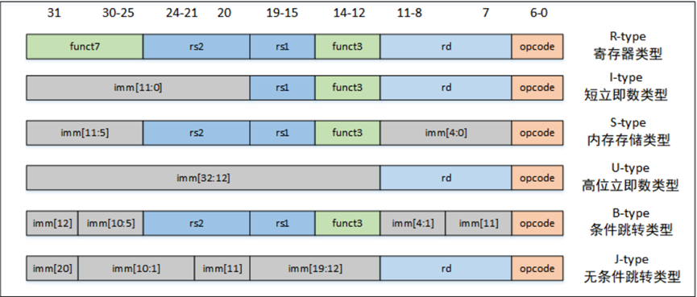

---

## PC寄存器技术文档

### 概述

PC（Program Counter，程序计数器）是计算机体系结构中的一个重要寄存器，用于存储正在执行的指令的地址或下一条将要执行的指令的地址。在指令执行期间，CPU会从程序计数器中读取下一条指令的地址，并将该地址发送到指令存储器中以取出指令。

在RISC-V RV32I指令集中，每当执行一条指令时，PC程序计数器便会根据信号实现地址的变化：
- 如果需要顺序执行下一条指令，PC程序计数器便会增加4个字节的地址，来得到存放下一个指令的地址；
- 如果遇到分支，则将PC置为需要跳转的指令地址；
- 如果递增至指令寄存器末端，则跳转回起始位置。

### 工作原理

PC寄存器模块使用了一些在`yadan_defs.v`中定义的宏：
- `InstAddrBus`：指令地址线的宽度，定义为32位；
- `RstEnable`：复位信号有效，定义为1'b1。即当输入`rst`为高电平时，表示复位信号有效。

在复位状态下，指令存储器的使能信号为`ReadDisable`，表示指令存储器禁用；其他时候，指令存储器的使能信号为`ReadEnable`，表示指令存储器使能。当指令存储器禁用时，PC的值保持为0；当指令存储器使能时，PC的值会在每个时钟周期加4，表示下一条指令的地址，这是由于一条指令共32位，yadan core是可以按照字节寻址的，一条指令对应4个字节，所以PC加4指向下一条指令地址。

```verilog
include "yadan_defs.v"

module pc_reg(
    input       wire                clk,
    input       wire                rst,
    input       wire                PCchange_enable,
    input       wire                set_mode,
```

上面的代码定义了`pc_reg`模块的接口，包括输入信号`clk`、`rst`、`PCchange_enable`、`set_mode`等。复位信号`rst`用于初始化PC寄存器。

```verilog
    input       wire                branch_flag_i,
    input       wire[`RegBus]       branch_addr_i,
    input       wire[5:0]           stalled,

    output      reg[`InstAddrBus]   pc_o,
    output      wire                ce_o 
);
```

接下来定义了分支标志`branch_flag_i`、分支地址`branch_addr_i`、暂停信号`stalled`等输入信号。输出信号`pc_o`表示程序计数器的值，`ce_o`表示指令存储器使能信号。

```verilog
    assign  ce_o = PCchange_enable;
```

这里将指令存储器使能信号`ce_o`与`PCchange_enable`信号关联起来。

```verilog
    always  @ (posedge clk or negedge rst) begin
        if(rst == `RstEnable) begin
            if(set_mode) begin
                pc_o    <=  `StartAdd;
            end
            else begin
                pc_o    <=  `ZeroWord;
            end 
        end       
        else begin 
```

在时钟信号上升沿或复位信号下降沿时触发。复位信号有效时，如果`set_mode`为真，PC被设置为初始地址`StartAdd`，否则设置为`ZeroWord`。

```verilog
            if (branch_flag_i == `BranchEnable) begin
                pc_o    <= branch_addr_i;
            end 
            else if (PCchange_enable == 1'b0) begin
                pc_o    <=  pc_o;
            end 
            else if (stalled[0] == `NoStop) begin
                if(pc_o <= `INSTADD_END) begin
                    pc_o    <= pc_o + 4'h4;
                end
                else begin
                    pc_o  <=  `StartAdd;
                end
            end
            else begin
                pc_o    <=  pc_o;
            end
        end
    end
endmodule // pc_reg
```

在非复位状态下，根据输入信号的状态更新PC寄存器的值：
- 如果`branch_flag_i`信号有效，PC跳转到`branch_addr_i`所指定的地址。
- 如果`PCchange_enable`信号无效，PC保持不变。
- 如果流水线未暂停，且`stalled[0]`信号为`NoStop`，PC递增4字节。
- 如果递增至指令寄存器末端，则跳转回起始位置`StartAdd`。


---

## ID阶段原理与实现

在RISC-V处理器的设计中，ID（Instruction Decode）阶段是关键的一步，它负责从程序计数器（PC）获取指令，并对其进行解码，以生成控制信号和地址信号，进而驱动后续的执行阶段。以下是对ID阶段原理和实现的详细描述。

### 工作原理

#### 指令划分
在ID阶段，首先需要从PC获取32位的指令。根据RISC-V ISA手册，指令的不同字段被赋予了特定的意义：
- **Opcode**：操作码，位于指令的最低7位（[6:0]），用于区分指令类型。
- **Rd**：目的寄存器，位于指令的第7到第11位（[11:7]），指定了操作结果的存储位置。
- **Funct3**：功能码3，位于指令的第12到第14位（[14:12]），进一步指定操作类型。
- **Rs1**：源寄存器1，位于指令的第15到第19位（[19:15]），指定了第一个操作数的来源。
- **Rs2**：源寄存器2，位于指令的第20到第24位（[24:20]），指定了第二个操作数的来源。
- **Funct7**：功能码7，位于指令的第25到第31位（[31:25]），用于某些指令类型中进一步指定操作细节。

```verilog
wire[6:0]   opcode  = inst_i[6:0];
wire[4:0]   rd      = inst_i[11:7];
wire[2:0]   funct3  = inst_i[14:12];
wire[4:0]   rs1     = inst_i[19:15];
wire[4:0]   rs2     = inst_i[24:20];
```

#### 指令译码
根据opcode和funct3的值，指令被分为不同的类型，如R型指令、I型指令、S/B型指令和U/J型指令以及CSR型指令。这些类型的指令具有相似的格式和数据通路，便于统一设计控制信号。



以S/B型指令为例，根据funct3的值进一步确定具体的操作类型：
```verilog
INST_S_TYPE: begin
    case (funct3)
        `INST_SB: begin         // sb
            wreg_o          = `WriteDisable; 
            aluop_o         = `EXE_SB;   
            alusel_o        = `EXE_RES_STORE; 
            reg1_read_o     = `ReadEnable;  
            reg2_read_o     = `ReadEnable;  
            instvalid       = `InstValid;

        end
        `INST_SH: begin        // sh
            wreg_o          = `WriteDisable; 
            aluop_o         = `EXE_SH;   
            alusel_o        = `EXE_RES_STORE; 
            reg1_read_o     = `ReadEnable;  
            reg2_read_o     = `ReadEnable;  
            instvalid       = `InstValid;

        end
        `INST_SW: begin        // sw
            wreg_o          = `WriteDisable; 
            aluop_o         = `EXE_SW;   
            alusel_o        = `EXE_RES_STORE; 
            reg1_read_o     = `ReadEnable;  
            reg2_read_o     = `ReadEnable;  
            instvalid       = `InstValid;

        end
        default: begin
            instvalid       =  `InstInvalid;
        end
    endcase
end
```

### 特殊情况处理

在ID阶段，需要处理一些特殊情况，例如：
1. **延迟写回**：如果Regfile模块读端口要读取的寄存器就是执行阶段要写的目的寄存器，则直接使用执行阶段的结果。
2. **访存结果**：如果Regfile模块读端口要读取的寄存器就是访存阶段要写的目的寄存器，则直接使用访存阶段的结果。

这些特殊情况的处理确保了指令执行的连贯性和效率。

### 具体实现

以`addi`指令为例，其指令格式为 `<imm[11:0] rs1[4:0] func3[2:0] rd[3:0] opcode[6:0]>`。在ID阶段，根据opcode找到对应的分支，并进行相应的赋值：
```verilog
INST_I_TYPE:   begin
    case (funct3)
        `INST_ADDI: begin       // addi
            wreg_o          = `WriteEnable;                      
            aluop_o         = `EXE_ADD;                           
            alusel_o        = `EXE_RES_ARITH;                    
            reg1_read_o     = `ReadEnable;                         
            reg2_read_o     = `ReadDisable;                       
            imm_2           = {{20{inst_i[31]}}, inst_i[31:20]}; 
            reg_wd_o        = rd;                                  
            instvalid       = `InstValid;  

        end
    endcase
end
```

### 确定源操作数

在确定源操作数时，需要考虑不同的读取情况：
```verilog
always @ (*) begin
    if (rst == `RstEnable) begin
        reg1_o  = `ZeroWord;
        reg1_loadralate = `NoStop;
    end else if (pre_inst_is_load == 1'b1 && ex_wd_i == reg1_addr_o && reg1_read_o == 1'b1) begin
        reg1_loadralate = `Stop;  
        reg1_o  = `ZeroWord;        
    end else if ((reg1_read_o == 1'b1) && (reg1_addr_o == 5'b00000)) begin
        reg1_o  = `ZeroWord;
        reg1_loadralate = `NoStop;
    end else if ((reg1_read_o == 1'b1) && (ex_wreg_i == 1'b1) && (ex_wd_i == reg1_addr_o)) begin
        reg1_o  = ex_wdata_i;
        reg1_loadralate = `NoStop;
    end else if ((reg1_read_o == 1'b1) && (mem_wreg_i == 1'b1) && (mem_wd_i == reg1_addr_o)) begin
        reg1_o  = mem_wdata_i;
        reg1_loadralate = `NoStop;
    end else if (reg1_read_o == 1'b1) begin
        reg1_o  = reg1_data_i; 
        reg1_loadralate = `NoStop;        // regfile port 1 output data
    end else if (reg1_read_o == 1'b0) begin
        reg1_o  = imm_1;                 // 立即数
        reg1_loadralate = `NoStop;
    end else begin
        reg1_o  = `ZeroWord;
        reg1_loadralate = `NoStop; 
    end
end
```

通过这种方式，ID阶段能够正确地解析指令，并为后续的执行阶段提供必要的控制信号和数据。


---


## 执行阶段（EX）原理与实现

执行阶段（EX）是RISC-V处理器中负责执行算术和逻辑操作的部分，它接收来自译码阶段（ID）的指令和数据，进行相应的操作，并产生结果。以下是对执行阶段原理和实现的详细描述。

### 模块接口

执行阶段模块`ex`的接口包括多个输入输出信号，用于与处理器的其他部分进行通信：

- **输入信号**：包括从译码阶段送来的信息，如指令、操作码、操作数等。
- **输出信号**：包括执行结果、要写入的寄存器地址和数据，以及控制信号等。

### 工作原理

#### 执行单元的初始化

执行阶段开始时，需要对执行单元内的一些寄存器进行初始化，以确保处理器的复位行为正确。

#### 执行算术和逻辑操作

执行阶段的核心是算术逻辑单元（ALU），它根据译码阶段提供的控制信号来执行各种操作，包括：

- **算术操作**：加法（`EXE_ADD`）、减法（`EXE_SUB`）、乘法（`EXE_MUL`）和除法（`EXE_DIV`）。
- **逻辑操作**：逻辑与（`EXE_AND`）、逻辑或（`EXE_OR`）、逻辑异或（`EXE_XOR`）。
- **移位操作**：逻辑左移（`EXE_SLL`）、算术右移（`EXE_SRA`）和逻辑右移（`EXE_SRL`）。
- **比较操作**：ALU比较两个操作数的大小，并根据比较结果设置处理器的状态标志，如小于（`SLT`）、等于（`SEQ`）等。
- **分支和跳转**：ALU计算分支指令的目标地址，以及确定分支是否应该发生。
- **CSR操作**：RISC-V中一些专用的指令还涉及到控制和状态寄存器（CSR）的操作，如读取-写入（`CSRRW`）、读取-设置（`CSRRS`）、读取-清除（`CSRRC`）等。

#### 处理中断

执行阶段还需要处理可能发生的中断。如果检测到中断信号，执行阶段将根据中断地址更新程序计数器（PC）。

### 具体实现

以下是执行阶段的一些关键实现细节：

```verilog
// 算术操作结果
wire[31:0] exe_res_sub = reg1_i - reg2_i;

// 多周期乘除法运算结束时，根据ALU操作选择结果
always @(*) begin
    if (muldiv_done) begin
        case (aluop_i)
            `EXE_DIV, `EXE_DIVU, `EXE_MULHU, `EXE_MULH, `EXE_MULHSU: arithresult = muldiv_result_i[63:32];
            `EXE_REM, `EXE_REMU, `EXE_MUL: arithresult = muldiv_result_i[31:0];
            `EXE_ADD: arithresult = (reg1_i + reg2_i);
            `EXE_SUB: arithresult = exe_res_sub;
            default: arithresult = `ZeroWord;
        endcase
    end else begin
        // 多周期乘除法未结束或未运行
        arithresult = `ZeroWord;
        case (aluop_i)
            `EXE_DIV, `EXE_REM: begin
                muldiv_start_o = 1'b1;
                mul_or_div = `DIV;
                muldiv_dividend_o = reg1_i;
                muldiv_divisor_o = reg2_i;
                muldiv_reg1_signed0_unsigned1 = `Signed;
                muldiv_reg2_signed0_unsigned1 = `Signed;
            end
            `EXE_DIVU, `EXE_REMU: begin
                muldiv_start_o = 1'b1;
                mul_or_div = `DIV;
                muldiv_dividend_o = reg1_i;
                muldiv_divisor_o = reg2_i;
                muldiv_reg1_signed0_unsigned1 = `Unsigned;
                muldiv_reg2_signed0_unsigned1 = `Unsigned;
            end
            // ... 其他ALU操作 ...
        endcase
    end
end
```

#### 比较和分支

执行阶段还需要根据比较结果设置分支标志，并计算分支地址：

```verilog
always @ (*) begin
    case (aluop_i)
        `EXE_BEQ: begin
            if (reg1_i == reg2_i) begin
                branch_flag = `BranchEnable;
                branch_addr = ex_pc + {{20{ex_inst[31]}}, ex_inst[7], ex_inst[30:25], ex_inst[11:8], 1'b0};
            end
        end
        `EXE_BNE: begin
            if (reg1_i != reg2_i) begin
                branch_flag = `BranchEnable;
                branch_addr = ex_pc + {{20{ex_inst[31]}}, ex_inst[7], ex_inst[30:25], ex_inst[11:8], 1'b0};
            end
        end
        // ... 其他分支情况 ...
    endcase
end
```

#### CSR操作

控制和状态寄存器（CSR）的操作也由执行阶段处理：

```verilog
always @ (*) begin
    case (aluop_i)
        `EXE_CSRRW: begin
            wcsr_data_o = reg1_i;
        end
        `EXE_CSRRS: begin
            wcsr_data_o = csr_reg_i | reg1_i;
        end
        `EXE_CSRRC: begin
            wcsr_data_o = csr_reg_i & (~reg1_i);
        end
        default: begin
            wcsr_data_o = `ZeroWord;
        end
    endcase
end
```

#### 结果选择和写回

最后，根据ALU选择信号`alusel_i`，从不同的操作结果中选择最终的执行结果，并准备写回：

```verilog
always @ (*) begin
    wd = wd_i;    // wd_o 等于 wd_i, 要写的目的寄存器地址
    wreg = wreg_i;  // wreg_o 等于 wreg_i,表示是否要写目的寄存器
    case (alusel_i)
        `EXE_RES_LOGIC: wdata = logicout;
        `EXE_RES_COMPARE: wdata = compare;
        `EXE_RES_SHIFT: wdata = shiftres;
        `EXE_RES_ARITH: wdata = arithresult;
        `EXE_RES_BRANCH: wdata = branchres;
        `EXE_RES_CSR: wdata = wcsr_data_o;
        default: wdata = `ZeroWord;
    endcase
end
```

### 总结

执行阶段是处理器中实现指令具体操作的部分，它涉及到算术逻辑运算、分支判断、中断处理以及CSR操作等多个方面。通过上述实现，我们可以看到执行阶段如何根据控制信号来执行不同的操作，并产生结果，为后续的访存阶段（MEM）和写回阶段（WB）做好准备。

### 具体实现示例

以`addi`指令为例，其指令格式为 `<imm[11:0] rs1[4:0] func3[2:0] rd[3:0] opcode[6:0] >`。在执行阶段，EX模块会先根据它的运算子类型来运算结果：

```verilog
`EXE_ADD: begin
    arithresult = (reg1_i + reg2_i);
end
```

其中`reg1_i`和`reg2_i`是ID模块译码后，CPU从寄存器堆中读到的两个结果，这里直接将值相加送到`arithresult`中。

然后进行判断，是否将结果写到寄存器中：

```verilog
wd = wd_i;    // wd_o 等于 wd_i, 要写的目的寄存器地址
wreg = wreg_i;  // wreg_o 等于 wreg_i,表示是否要写目的寄存器
```

由译码结果可知，`addi`操作的结果需要写到寄存器中，因此这里`wreg`为`WriteEnable`，`wd`为地址`rd`。

再根据运算类型的判断，将`arithresult`作为EX模块的最终输出结果送到回写模块中去：

```verilog
`EXE_RES_ARITH: begin
    wdata = arithresult;
end
```

这样，执行阶段就完成了对`addi`指令的执行，并将结果准备写回到指定的寄存器中。

---

## 访存阶段（MEM）介绍

访存阶段（MEM）主要负责处理所有与内存交互的操作。在RISC-V架构中，MEM阶段主要涉及两种类型的指令：加载（L）指令和存储（S）指令。这些指令涉及到从内存中加载数据到寄存器，或者将数据从寄存器存储到内存。

### 主要功能

1. **接收执行阶段数据**：MEM阶段接收来自执行阶段（EX）的数据，包括目标寄存器地址、数据以及控制信号。

2. **访存操作**：根据执行阶段的指令类型，执行访存操作。对于加载指令，从内存中读取数据；对于存储指令，将数据写入内存。

3. **数据位宽处理**：对于不同位宽的数据加载，MEM阶段负责进行符号扩展或零扩展，确保数据在处理器内部以32位格式表示。

4. **内存地址和数据控制**：生成内存地址，控制数据的读写，包括内存使能（mem_ce_o）、写使能（mem_we_o）、片选（mem_sel_o）等信号。

### L指令的访存操作

加载（L）指令用于从内存中加载数据到寄存器。根据加载数据的大小，可以分为字节（B）、半字（H）、字（W）等类型。对于有符号数的非全字操作，需要进行符号位扩展，确保数据的高位与最低位的符号位相同：

```verilog
2'b00: begin
    wdata_o = {{16{mem_data_i[15]}}, mem_data_i[15:0]};
end
```

对于无符号数的加载，需要在前面补零，保证数据为32位：

```verilog
2'b00: begin
    wdata_o = {24'h0, mem_data_i[7:0]};
end
```

### S指令的访存操作

存储（S）指令用于将数据从寄存器存储到内存。根据存储数据的大小，同样可以分为字节（B）、半字（H）、字（W）等类型。对于单字节存储操作，需要在前面补24位0：

```verilog
`EXE_SB : begin         // sb
    mem_we = `WriteEnable;
    mem_ce =  `Enable;
    mem_data_o = {24'h000000, mem_reg2_i[7:0]};
    mem_sel_o = 3'b000;
    wdata_o = wdata_i;
end
```

对于半字操作，直接将数据复制一次：

```verilog
`EXE_SH: begin          // sh
    mem_we = `WriteEnable;
    mem_ce = `Enable; 
    mem_data_o = {mem_reg2_i[15:0], mem_reg2_i[15:0]};
    mem_sel_o = 3'b001;
    wdata_o = wdata_i;
end
```

对于全字操作，直接存取32位数据，无需任何扩展或复制。

---

## 访存-写回阶段（MEM_WB）介绍

访存-写回阶段（MEM_WB）是处理器流水线的最后阶段，它的主要任务是将访存阶段（MEM）的结果传递到寄存器文件（Register File），完成指令的最终结果写回。以下是对MEM_WB阶段的介绍：

### 主要功能

1. **数据转发**：接收来自访存阶段的数据和控制信号，并将它们转发到寄存器文件。

2. **时序控制**：使用时序逻辑确保数据在适当的时钟周期写回寄存器文件。

3. **处理暂停和刷新**：在流水线暂停（Stall）或刷新（Flush）情况下，控制写回逻辑，以避免错误的数据写回。


### 具体实现

以下是MEM_WB模块的关键实现细节：

```verilog
always @ (posedge clk or negedge rst) begin
    if (rst == `RstEnable) begin
        wb_wd       <= `NOPRegAddr;  // 复位时，写回地址设置为无效地址
        wb_wreg     <= `WriteDisable;  // 复位时，禁止写回
        wb_wdata    <= `ZeroWord;  // 复位时，写回数据设置为零
    end else if (flush[4] == `Stop) begin
        // 刷新时，清除写回数据
        wb_wd       <= `NOPRegAddr;
        wb_wreg     <= `WriteDisable;
        wb_wdata    <= `ZeroWord;
    end else if (stalled[4] == `Stop && stalled[5] == `NoStop) begin
        // 流水线暂停时，保持当前状态
        wb_wd       <= `NOPRegAddr;
        wb_wreg     <= `WriteDisable;
        wb_wdata    <= `ZeroWord;
    end else if (stalled[4] == `NoStop) begin
        // 流水线正常工作时，转发访存阶段的数据
        wb_wd       <= mem_wd;
        wb_wreg     <= mem_wreg;
        wb_wdata    <= mem_wdata;
    end
end
```

---

## 控制单元（CTRL）介绍

控制单元（CTRL）是处理器流水线的核心组件，负责协调和管理流水线中的各种控制信号，确保指令的正确执行和数据的正确流动。以下是对CTRL模块的详细介绍：

### 主要功能

1. **接收分支信号**：从执行阶段（EX）接收分支信号，根据分支结果更新程序计数器（PC）。

2. **接收暂停请求**：从流水线的各个阶段接收暂停请求信号，以控制流水线的暂停行为。

3. **生成控制信号**：生成分支标志、流水线停顿和刷新信号，以控制流水线的走向。

### 工作原理

1. **分支处理**：当执行阶段产生分支信号时，CTRL模块将更新分支标志和分支地址，以便在流水线中实现跳转。

2. **暂停请求处理**：CTRL模块接收来自ID、EX、MEM等阶段的暂停请求，并根据这些请求生成相应的停顿信号。

<!-- 3. **刷新控制**：在某些情况下，如分支跳转发生时，CTRL模块将刷新流水线，确保流水线中的数据是最新的。-->

### 具体实现

以下是CTRL模块的关键实现细节：

```verilog
always @ (*) begin
    // if (rst == `RstEnable) begin
    //     stalled_o       = 6'b000000;
    //     flush_o         = 6'b000000;
    //     branch_flag_o   = `BranchDisable;
    //     branch_addr_o   = `ZeroWord;
    // end else begin
        branch_flag_o   = branch_flag_i;
        branch_addr_o   = branch_addr_i;
        // stalled_o       = 6'b000000;
        flush_o         = 6'b000000;

        if (stallreq_from_mem == `Stop ) begin //&& branch_flag_i == `BranchDisable) begin  
            // flush_o     =  6'b000100;
            stalled_o   =  6'b011111;
        end
            else 
        
        if (stallreq_from_ex == `Stop && branch_flag_i == `BranchDisable) begin
            stalled_o   =  6'b001111;
        end
        else 
        if (stallreq_from_id == `Stop && branch_flag_i == `BranchDisable) begin    
            // flush_o     =  6'b000010;
            stalled_o   =  6'b000111;
        end 
        else if (stallreq_from_if == `Stop ) begin
            stalled_o   =  6'b000111;
        end
        else begin
            stalled_o   = 6'b000000;
            // flush_o     = 6'b000000;
        end            
    // end

end
```

---
## CPU-AHB接口（`cpu_ahb_if`）模块介绍

### 概述
`cpu_ahb_if`模块利用一段式状态机实现通过系统总线与ROM的信息交互。

### 复位状态下的端口重置
在`Rst`复位情况下，各端口将重置为以下状态：

- `cpu_readdate_o` = `ZeroWord`；
- `M_HBUSREQ` = 1'b0； // 总线请求为0
- `M_HADDR` = `ZeroWord`；// 数据地址
- `M_HTRANS` = 2'b10；  // 传输状态：只传输一个数据
- `M_HSIZE` = 3'b010；  // 每次4字节
- `M_HBURST` = 3'b000； // 传输策略：只传一个数据
- `M_HWRITE` = 1'b0；   // 读设备
- `M_HWDATA` = `ZeroWord`；
- `nxt_state` = IDLE；  // 下一状态为IDLE
- `stallreq` = 1'b0；   // 流水线不停顿

### 状态机描述
状态机共有四个状态：IDLE、WAIT、CONTROL、ENDS。

#### IDLE状态
```verilog
IDLE: begin
    if (cpu_ce_i) begin
        stallreq = 1'b1;   
        M_HBUSREQ = 1'b1;
        nxt_state = WAIT;
    end else begin
        stallreq = 1'b1; 
        M_HBUSREQ = 1'b0;
        nxt_state = IDLE;
    end
end
```
若ROM使能，则发送流水线中断信号并请求总线，进入WAIT状态；若未使能则保持在IDLE状态。

#### WAIT状态
```verilog
WAIT: begin 
    if (cpu_ce_i) begin
        stallreq = 1'b1;
        M_HBUSREQ = 1'b1;
        if (M_HGRANT) begin
            nxt_state = CONTROL;
        end else begin
            nxt_state = WAIT;
        end
    end else begin
        stallreq = 1'b1;
        M_HBUSREQ = 1'b0;
        nxt_state = IDLE;
    end
end
```
在WAIT阶段，进一步判断仲裁结果，若获得控制权则跳转到CONTROL状态，否则继续等待。

#### CONTROL状态
```verilog
CONTROL: begin 
    if (cpu_ce_i) begin
        stallreq = 1'b1;
        M_HBUSREQ = 1'b1;
        nxt_state = ENDS;
    end else begin
        stallreq = 1'b1;
        M_HBUSREQ = 1'b0;
        nxt_state = IDLE;
    end
end
```
CONTROL是一个过渡状态，准备进入ENDS状态以完成数据交换。

#### ENDS状态
```verilog
ENDS: begin
    if (cpu_ce_i) begin
        stallreq = 1'b0;
        M_HBUSREQ = 1'b1; 
        nxt_state = ENDS;
        if (cpu_we_i == `WriteEnable) begin
            M_HWDATA = cpu_writedate_i;
        end else begin
            cpu_readdate_o = M_HRDATA;
        end
    end else begin
        stallreq = 1'b1;
        M_HBUSREQ = 1'b0;
        nxt_state = IDLE;
    end
end
```
对于ROM，只读不写，因此`cpu_we_i`一定为WriteDisable。在ENDS状态，通过总线读取数据到`cpu_readdate_o`，流水线中断信号置0，保持总线请求，状态停留在ENDS，保证流水线正向运行。若ROM使能信号为0，则回到IDLE阶段，等待下一次使能。

---
## CPU-AHB内存接口（`cpu_ahb_mem`）介绍

### 概述
`cpu_ahb_mem`模块利用一段式状态机实现通过系统总线与RAM的信息交互，与`cpu_ahb_if`模块整体一致，但存在一些关键差异。

### 主要差异点
1. **可读可写**：与ROM不同，RAM是可读可写的，因此`cpu_we_i`可以设置为`WriteEnable`。
2. **总线就绪信号**：引入了`M_HREADY`信号，当为0时表示总线上有设备忙碌。在这种情况下，状态机将停留在`ENDS`状态，并发送流水线中断请求，直到总线空闲并完成数据读写。
   ```verilog
   if (M_HREADY == 1'b0) begin
       stallreq = 1'b1;
       nxt_state = ENDS;
   end else begin
       stallreq = 1'b0;
       // nxt_state = WAIT2;
   end
   ```
3. **流水线中断请求**：当RAM未使能时，流水线中断请求将一直处于关闭状态，不影响流水线工作。仅在RAM工作时才发送流水线停顿请求。
   ```verilog
   IDLE: begin
       if (cpu_ce_i) begin
           stallreq = 1'b1;
           
           M_HBUSREQ = 1'b1;
           nxt_state = WAIT;
       end else begin
           stallreq = 1'b0;
           M_HBUSREQ = 1'b0;
           nxt_state = IDLE;
       end
   end 
   ```

### 工作模式
- **ROM**：保持流水线的正常工作，始终在工作状态，通常用于实现指令的读取。
- **RAM**：工作时会停顿流水线，在访存时才会启用，通常用于存放数据。

### 总线使用规范
值得注意的是，RAM使能信号与ROM使能信号在时钟上保持相反状态，以此确保总线使用的规范性，避免潜在的总线冲突。

---
