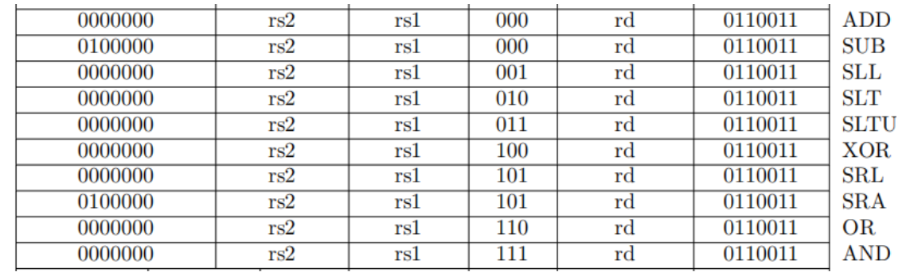

# 第一章 处理器概述

## 1.1 引言：探索处理器的奥秘与价值

随着时代的车轮滚滚向前，计算机技术已成为现代社会不可或缺的支柱。它赋予了人类前所未有的能力，极大地拓宽了人类认知与实践的边界——通过编程，我们能够驾驭庞大的数据，进行复杂的计算和深入的分析。你可能会好奇，这些强大的计算机究竟是如何运转的？如何构建一个专属于自己的处理器，并在它上面运行你精心编写的程序？

幸运的是，RISC-V这一开源指令集的迅猛发展，以其大道至简的特性，大大降低了学习CPU设计的技术门槛。本书将以将YADAN SoC作为RISC-V架构CPU的设计案例，带你深入处理器的内部世界，揭示其设计原理，并指导你如何一步步搭建起自己的RISC-V CPU处理器。

通过阅读本书，你不仅能够获得对处理器设计更深层次的理解，还能亲手实现一个属于你自己的计算核心，开启一段激动人心的创造之旅。

## 1.2 在YADAN上实现呼吸灯

由Verimake设计的YADAN项目是一个综合性的硬件设计学习平台，它由YADAN Core、YADAN SoC和YADAN Board三个核心组件构成。YADAN Core是基于RISC-V指令集的CPU内核，而YADAN SoC则是围绕这个CPU内核构建的片上系统（SoC，System on Chip），集成多种外设，允许开发者根据需求进行灵活配置。YADAN Board则是一个搭载有Anlogic FPGA的开发板，YADAN SoC可以被部署在其上，为学习和实践提供一个实际的硬件平台。[YADAN 主文档：docs.yadanboard.com](http://docs.yadanboard.com/)

接下来，我们将通过一个简单的示例程序，演示如何在YADAN Board上实现呼吸灯效果，从而初步探索计算机系统的基本工作机制。对于那些渴望亲自动手尝试的读者，YADAN Board的获取和环境配置指南可以在官方文档中找到。

### 1.2.1 C语言示例程序

以下是一个用C语言编写的简单程序，用于在YADAN Board的GPIO第13号引脚上实现呼吸灯效果。程序通过控制GPIO引脚的高低电平以及延时来模拟PWM（脉冲宽度调制）控制，实现LED的亮度调节。

```c
// 宏定义简化对寄存器的访问
#define REG(add) (*(volatile unsigned int *)(add))

// 定义GPIO寄存器地址
#define PADDIR REG(0x4A101000) 	// GPIO方向寄存器
#define PADOUT REG(0x4A101008)  // GPIO输出寄存器


int main()
{
    PADDIR |= (1 << 13);	// 设置GPIO的第13号引脚为输出模式
    int num = 850; 			// 定义控制呼吸效果的周期数
    while (1) 				// 主循环
    {
        // 呼吸灯渐亮过程：逐渐增加LED闪烁时的点亮时间
        for (int j = 0; j < num; j++)
        {
            PADOUT |= (1 << 13); 				// 设置GPIO第13号引脚为高电平，点亮LED
            for (int i = 0; i < j; i++)			// 软件延时，延时时间随j的增加而增加
                ;
            PADOUT &= ~(1 << 13); 				// 设置GPIO第13号引脚为低电平，熄灭LED
            for (int i = 0; i < num - j; i++)	// 软件延时
                ;
        }

        // 呼吸灯渐暗过程：逐渐减少LED闪烁时的点亮时间
        for (int j = num; j > 0; j--)
        {
            PADOUT |= (1 << 13);
            for (int i = j; i > 0; i--)
                ;
            PADOUT &= ~(1 << 13);
            for (int i = num - j; i > 0; i--)
                ;
        }
    }

    return 0; // 此行通常不会被执行
}
```

呼吸灯效果的实现依赖于精确控制LED的闪烁周期和占空比，这通常通过延时控制来完成。在每个周期内，LED被点亮的时间长度（即高电平的持续时间）决定了人眼感知到的亮度。

延时可以通过软件循环来实现，也可以通过定时器来实现。本示例程序采用了软件循环延时的方法，主要是出于简化实现和便于理解的考虑。如果不希望占用CPU资源，或对时间精度要求较高，考虑使用定时器实现硬件层面的延时。

### 1.2.2 从C语言到机器码

上文中的C语言程序看起来直观易懂，但硬件本身并不直接执行这种高级语言，硬件只能执行由二进制数字组成的机器码(Machine Code)。机器码是计算机硬件可以直接理解和执行的低级语言，它是一系列二进制指令的集合，每个指令都对应于处理器指令集架构（ISA，Instruction Set Architecture）中定义的具体操作。

在现代计算机中，所有的信息，包括指令和数据，都是用二进制形式表示的，即通过0和1的组合来编码。处理器内部具备译码单元，它的功能是根据 ISA 解释这些0和1编码的指令。译码单元解析指令的二进制位模式，确定要执行的运算类型和操作细节。

例如，一个二进制串`...0110011`可能表示一个算术运算操作。在RISC-V或类似架构中，这个二进制串的每一位都有特定的含义。根据指令集的定义，某些位可能指示操作类型（如算术加法），其他位可能指示操作数的来源（如寄存器地址），还有的位可能指示操作的结果应该存储在哪里。处理器的译码单元会读取这个二进制串，解析出这些信息，并执行相应的操作。

理论上，程序员可以直接使用这种0和1的编码来编写程序，但这种方法不仅繁琐，而且极易出错，不利于阅读和维护。为了解决这个问题，人们引入了汇编语言，它使用助记符来代表特定的机器指令操作。例如，汇编指令`add a, a, b` 可能对应于一个将寄存器b的值加到寄存器a上的操作。

汇编语言虽然比直接编写二进制指令要方便，但仍然需要程序员关注底层的硬件细节。随着软件工程的发展，高级语言被发明出来，它们提供了更为抽象和易于理解的语法结构。高级语言如C 和 Java，允许开发者专注于算法和逻辑结构，而不必处理具体的硬件指令。高级语言编写的程序最终需要转换为机器可以执行的二进制编码。这个过程虽然在不同的抽象层次上有所不同，但本质上都是将人类的可读语言转换为计算机的可执行指令。

将C语言代码通过编译（广义）转换为硬件能够执行的机器码，一般需要经历以下一系列的步骤：

1. **预处理（Preprocess）**：编译器首先处理代码中的预处理指令，如宏定义的展开和条件编译指令，为编译阶段准备源代码（`.i` 文件）。
2. **编译（Compile）**：编译器将C语言代码转换成汇编语言（`.s` 文件）。这一过程将高级语言中的抽象行为转换为与特定ISA兼容的低级指令，即汇编指令，仍保持一定的可读性。编译时，开发者需要指定目标硬件平台。
3. **汇编（Assemble）**：汇编器将汇编语言进一步转换成机器码（`.o` 文件）。这一过程将文本形式的汇编指令转换为二进制形式的机器指令，这些指令是直接由硬件执行的具体操作。
4. **链接（Link）**：链接器将分散的代码模块和库函数合并起来，形成一个单一的可执行文件（`.elf` 文件）。这个过程涉及到解决代码中的外部引用，确保所有依赖的代码段和数据段被正确地组织在最终的可执行文件中。
5. 最终生成的可执行文件包含了所有必要的机器码，以及所有必要的元数据，如程序的入口点和其他硬件所需的信息。这些元数据确保了程序能够在目标硬件上正确地初始化和执行。

整个编译过程涉及到编译器、汇编器和链接器等工具，它们共同工作，将高级语言代码转换成特定硬件能够理解和执行的低级指令。这一过程还必须考虑到目标硬件平台的特定架构和资源限制，以确保生成的代码既高效又适合在该硬件上运行。

<div style="display: flex; flex-direction: column; align-items: center;">
    
    <div style="color: black; padding: 2px; margin-top: 10px;">
        从C语言到机器码
    </div>
</div>


### 1.2.3 观察编译过程

以上的一系列工作可以通过特定的工具链来完成，这些工具链是专门为不同的硬件平台和指令集架构设计的。对于RISC-V架构的CPU，RISC-V GCC工具链能够面向其生成可执行的机器码。除此之外，工具链还包括了调试器、仿真器等辅助开发的工具，它们为开发者提供了代码调试、运行时错误检测和性能分析等功能。下面我们以跨平台RISC-V GCC工具链 The xPack GNU RISC-V Embedded GCC 为例，试着编译上面以C语言编写的呼吸灯程序`main.c`。

#### 1. 预处理（Preprocess）

预处理是编译过程的第一个阶段，它主要负责处理源代码文件中的预处理指令，如宏定义、文件包含等。在终端中，使用以下命令对 `main.c` 进行单独的预处理：

```shell
riscv-none-embed-gcc -march=rv32im -mabi=ilp32 -E -o main.i main.c
```

**参数解释**

上面的命令中，`riscv-none-embed-gcc`是我们所运行的编译器，`none-embed` 表示该编译器用于嵌入式系统，不依赖于特定的操作系统。

- `-march=rv32im`：指定目标架构为 RISC-V 32位处理器，并支持整数（I）与乘除法（M）指令集扩展。
- `-mabi=ilp32`：指定应用二进制接口（ABI），这里 `ilp32` 表示 32 位整型（`int`）、长整型（`long`）、指针（`pointer`）都使用 32 位，适用于不支持浮点扩展指令的 YADAN Core。
- `-E`：指示编译器只执行预处理步骤，不进行编译、汇编或链接。这对于调试和查看宏定义如何影响源代码非常有用。
- `-o main.i`：指定输出文件的名称，预处理后的文件将被命名为 `main.i`。
- `main.c`：指定源代码文件。

**预处理结果**

以下是预处理命令生成的`main.i`文件的内容：

```c
# 1 "main.c"
# 1 "<built-in>"
# 1 "<command-line>"
# 1 "main.c"
# 9 "main.c"
int main()
{
    (*(volatile unsigned int *)(0x4A101000)) |= (1 << 13);
    int num = 850;
    while (1)
    {

        for (int j = 0; j < num; j++)
        {
            (*(volatile unsigned int *)(0x4A101008)) |= (1 << 13);
            for (int i = 0; i < j; i++)
                ;
            (*(volatile unsigned int *)(0x4A101008)) &= ~(1 << 13);
            for (int i = 0; i < num - j; i++)
                ;
        }


        for (int j = num; j > 0; j--)
        {
            (*(volatile unsigned int *)(0x4A101008)) |= (1 << 13);
            for (int i = j; i > 0; i--)
                ;
            (*(volatile unsigned int *)(0x4A101008)) &= ~(1 << 13);
            for (int i = num - j; i > 0; i--)
                ;
        }
    }

    return 0;
}
```

得到的 `main.i` 文件仍是C语言程序，与原始的 `main.c` 文件相比，有几个显著的变化：

- **宏展开**：所有`#define`宏定义，如 `REG`、`PADDIR` 和 `PADOUT`，都被替换为它们的实际值或表达式。

- **注释删除**：源代码中的所有注释（包括单行和多行注释）在预处理后被删除，因为它们对编译器来说是不必要的。

- **预处理器指令**：预处理器添加了一些指令，如文件和行号信息，用于在调试过程中帮助定位原始代码。

此外，如果源代码中包含 `#include` 指令，预处理器会将被包含的文件内容插入到该指令的位置，递归地展开所有包含的文件。

值得注意的是，预处理步骤不检查源代码的语法正确性，仅执行预处理指令。因此，如果源代码中存在语法错误，这些错误将不会被预处理步骤发现，而会在后续的编译步骤中被编译器捕获。

#### 2. 编译（Compile）

编译环节负责将C语言代码转换为特定指令集架构（ISA）所规定的汇编代码。这个过程不仅涉及将高级逻辑翻译成机器可执行的低级指令，还包括对语法规则的检查和验证。编译器在这一过程中必须理解并遵循目标ISA的操作码、寄存器分配规则和指令格式。此外，编译器也会进行代码优化，以确保生成的程序既高效又符合硬件平台的特点。

在终端中，使用以下命令对 `main.i` 进行编译：

```shell
riscv-none-embed-gcc -march=rv32im -mabi=ilp32 -S -o main.s main.i
```

参数 `-S` 指示编译器在编译过程中跳过汇编步骤，直接生成 `.s` 汇编语言文件。编译的成功进行建立在源文件语法正确的基础之上；如果程序语法通过了验证，即使程序存在逻辑或功能上的错误，编译器也不会报错。

打开 `main.s` 文件，我们可以查看编译器生成的汇编代码。这些代码是RISC-V架构的低级表示，可能对初学者来说有些难以理解。但不用担心，我们会在后续的***某节（待补充）***中详细讲解RISC-V指令集的基础知识。

现在，让我们逐段分析编译产生的汇编代码的含义：

**全局设置，函数入口与栈帧设置**

```assembly
	.file	"main.c"		# 文件信息：指示汇编代码来源于 main.c 文件
	.option nopic			# 编译选项：不使用 PIC（位置无关代码）
	.text					# 指示接下来的部分是可执行代码（文本段）
	.align	2				# 确保代码的对齐，以满足内存访问要求
	.globl	main			# 声明 main 为全局符号，可在其他编译单元引用
	.type	main, @function
main:						# 函数入口：表示 main 函数的开始
	addi	sp,sp,-48		# 调整栈指针 sp，为局部变量分配48字节的栈空间
	sw	s0,44(sp)			# 将原来的栈指针 s0 保存到栈中，建立新的栈帧
	addi	s0,sp,48		# 更新帧指针 s0 指向新的栈帧底部，为局部变量访问提供基地址
```

这些步骤在C语言的高级抽象中通常是不可见的，因为它们是由编译器自动处理的底层细节，程序员通常不需要关心。然而，在汇编语言级别，每个操作都明确地反映了CPU如何与内存交互，以及如何管理栈帧。

**初始化 GPIO 方向寄存器**

```assembly
	li	a5, 1242566656      # 加载 PADDIR 寄存器的地址到寄存器 a5
	lw	a3, 0(a5)           # 从 PADDIR 地址加载当前值到 a3
	li	a5, 1242566656      # 重新加载 PADDIR 寄存器地址
	li	a4, 8192            # 加载 (1 << 13) 的值到 a4
	or	a4, a3, a4          # 将 a3 和 a4 的值进行逻辑或操作，设置 a4 的第 13 位为1
	sw	a4, 0(a5)           # 将更新后的值写回 PADDIR
```

这一段汇编指令完成了C代码中 `PADDIR |= (1 << 13);` 这一行代码的功能。可以看出，虽然初始化GPIO方向寄存器在C语言中只需简单的位或操作，但在汇编层面，它涉及到多个步骤，包括加载地址、读取当前值、修改位和写回新值。

**初始化控制变量**

```assembly
li	a5, 850             	# 设置 a5，即循环控制变量 num 的值为850
sw	a5, -44(s0)         	# 将 num 存入栈帧中
```

**主循环：LED 呼吸效果**

主循环在增加和减少 LED 亮度之间交替。

渐亮阶段

```assembly
.L14:						# 主循环开始
    sw	zero, -20(s0)       # 初始化外层循环计数器 j
    j	.L2                 # 跳转到外层循环条件检查
.L7:
    li	a5, 1242566656      # 加载 PADOUT 的基地址到 a5
    addi	a5, a5, 8       # 计算 PADOUT 地址
    lw	a3, 0(a5)           # 加载 PADOUT 的当前值
    li	a5, 1242566656
    addi	a5, a5, 8
    li	a4, 8192            # 加载 (1 << 13) 的值
    or	a4, a3, a4          # 设置 PADOUT 的第 13 位
    sw	a4, 0(a5)           # 写回 PADOUT 以点亮 LED
    sw	zero, -24(s0)       # 初始化第一个延时计数器 i
    j	.L3                 # 跳转到第一个延时循环条件检查
.L4:
    lw	a5, -24(s0)         # 加载第一个延时计数器 i
    addi	a5, a5, 1       # 增加 i
    sw	a5, -24(s0)         # 存储增加后的 i
.L3:
    lw	a4, -24(s0)         # 加载第一个延时计数器 i
    lw	a5, -20(s0)         # 加载外层循环计数器 j
    blt	a4, a5, .L4         # 如果 i < j，重复延时循环，否则延时结束，向下执行
    li	a5, 1242566656
    addi	a5, a5, 8
    lw	a3, 0(a5)           # 加载 PADOUT 的当前值
    li	a5, 1242566656
    addi	a5, a5, 8
    li	a4, -8192           # 准备清除 PADOUT 的第 13 位
    addi	a4, a4, -1      # 确保掩码正确
    and	a4, a3, a4          # 清除 PADOUT 的第 13 位
    sw	a4, 0(a5)           # 写回 PADOUT 以熄灭 LED
    sw	zero, -28(s0)       # 初始化第二个延时计数器 j
    j	.L5                 # 跳转到第二个延时循环条件检查
.L6:
    lw	a5, -28(s0)         # 加载第二个延时计数器 i
    addi	a5, a5, 1       # 增加 i
    sw	a5, -28(s0)         # 存储增加后 i
.L5:
    lw	a4, -44(s0)         # 加载常量 num
    lw	a5, -20(s0)         # 加载循环计数器 j
    sub	a5, a4, a5         	# 计算 num - j
    lw	a4, -28(s0)         # 加载第二个延时计数器 i
    blt	a4, a5, .L6         # 如果 i < num - j，重复延时循环，否则延时结束，向下执行
    lw	a5, -20(s0)         # 加载循环计数器 j
    addi	a5, a5, 1       # 增加 j
    sw	a5, -20(s0)         # 存储增加后的 j
.L2:
    lw	a4, -20(s0)         # 加载循环计数器 j
    lw	a5, -44(s0)         # 加载常量 num
    blt	a4, a5, .L7         # 如果 j < num，重复渐亮阶段，否则循环结束，向下执行

```

这一段汇编指令使呼吸灯逐渐变亮，包含三层嵌套循环，分别是最内层的两个延时循环，管理延时时间的外层循环，和最外层的主循环。

- 主循环从标签 `.L14`开始，对应C语言源代码中的 `while(1)`。

- 外层循环从标签 `.L7`开始，通过改变计数器 `j` 的值来改变延时循环的循环次数，管理亮度的增加。

- 延时循环从标签 `.L4` 和 `L6` 开始，以 `i` 为循环计数器，为LED的点亮和熄灭实现延时效果。

渐暗阶段

```assembly
	lw	a5, -44(s0)         # 加载 num
    sw	a5, -32(s0)         # 用 num 初始化外层循环计数器 j
    j	.L8                 # 跳转到外层循环条件检查
.L13:
    li	a5, 1242566656
    addi	a5, a5, 8
    lw	a3, 0(a5)
    li	a5, 1242566656
    addi	a5, a5, 8
    li	a4, 8192
    or	a4, a3, a4
    sw	a4, 0(a5)         
    lw	a5, -32(s0)    
    sw	a5, -36(s0)
    j	.L9                 
.L10:
    lw	a5, -36(s0)       
    addi	a5, a5, -1      
    sw	a5, -36(s0)       
.L9:
    lw	a5, -36(s0)       
    bgtz	a5, .L10        
    li	a5, 1242566656    
    addi	a5, a5, 8       
    lw	a3, 0(a5)         
    li	a5, 1242566656    
    addi	a5, a5, 8
    li	a4, -8192
    addi	a4, a4, -1
    and	a4, a3, a4
    sw	a4, 0(a5)
    lw	a4, -44(s0)
    lw	a5, -32(s0)
    sub	a5, a4, a5
    sw	a5, -40(s0)
    j	.L11
.L12:
    lw	a5, -40(s0)
    addi	a5, a5, -1
    sw	a5, -40(s0)
.L11:
    lw	a5, -40(s0)
    bgtz	a5, .L12
    lw	a5, -32(s0)
    addi	a5, a5, -1
    sw	a5, -32(s0)
.L8:
    lw	a5, -32(s0)
    bgtz	a5, .L13        # 如果 j > 0，重复渐暗阶段
    j	.L14                # 跳回亮起阶段开始
```

这一段仍处于主循环之内，类似地，由外层循环管理延时时间，并包含两个延时循环，使呼吸灯逐渐变暗。

**函数大小和版本信息**

```assembly
.size	main, .-main
.ident	"GCC: (GNU MCU Eclipse RISC-V Embedded GCC, 64-bit) 8.2.0"
```

这些指令提供了`main`函数的大小和编译器的版本信息。


#### 3. 汇编（Assemble）

汇编环节将上一步生成的汇编代码转换为二进制机器码。汇编器依赖于目标平台的指令集架构（ISA）来确定操作码、操作数类型、指令格式和地址模式，最终将指令和操作数编码为二进制形式，并计算跳转和分支指令的目标地址。

在终端中，使用以下命令对 `main.s` 进行汇编：

```shell
riscv-none-embed-gcc -march=rv32im -mabi=ilp32 -c -o main.o main.s
```

其中，参数 `-c` 指示编译器编译、汇编指定的源文件，但不进行链接。这一步生成 `.o` 文件，也称为目标文件。

<div style="display: flex; flex-direction: column; align-items: center;">
    
    <div style="color: black; padding: 2px; margin-top: 10px;">
        使用十六进制查看器打开.o文件
    </div>
</div>

#### 4. 链接（Link）

尽管我们已经有了`.o`目标文件，但这些文件还不能直接运行。目标文件虽然是二进制格式，但仍是一种中间文件。它们可能包含未解析的外部符号，如函数或变量的引用，需要链接器来解析。此外，`.o`文件尚未配置程序的入口点，也不包含运行时环境所需的元数据。因此，`.o`文件必须经过链接器的处理，链接成一个包含所有必要代码、数据、入口点和运行时信息的完整可执行文件（如 `.elf`、`.exe` 文件）后，才能被机器直接加载和运行。

为了在YADAN或其他RISC-V硬件上运行程序，除了用户编写的代码外，我们还需要整合一段必要的启动代码（startup code）。这段代码负责初始化系统，设置处理器状态，并最终调用`main`函数。YADAN提供了一个简化的启动代码示例`crt0_riscv.S`，它包含了初始化堆栈、清零BSS段、加载程序等关键步骤。这段代码对于程序的启动至关重要，需要与用户编写的代码一起进行链接。

我们将其复制到工程目录下，并使用以下命令将其汇编为另一个`.o`文件：

```shell
riscv-none-embed-gcc -march=rv32im -mabi=ilp32 -c -o crt0_riscv.o crt0_riscv.S
```

接下来，使用链接脚本（通常是`.ld`文件）来指导链接器将目标文件和系统组件（如标准库函数等）组合成一个可执行文件。YADAN提供的 `link.ld` 示例可以完成这项工作。将其复制到工程目录下，使用以下命令进行链接：

```shell
riscv-none-embed-ld -T link.ld main.o crt0_riscv.o -o main.elf
```

这将生成`main.elf`文件，它是一个完整的可执行文件，包含了所有必要的代码、数据、入口点和运行时信息。

为了更好地理解`.elf`文件的内容，使用`objdump`工具对其进行反汇编，得到对应的汇编语言代码：

```shell
riscv-none-embed-objdump -D main.elf > code.s
```

通过查看生成的`code.s`文件，可以观察到启动代码`crt0_riscv.S`被放在了程序的开头，随后通过 `jal ra,10c <main>` 指令跳转到 `main` 函数的入口：

```assembly
...

0000012c <main_entry>:
 12c:	00000513          	li	a0,0
 130:	00000593          	li	a1,0
 134:	020000ef          	jal	ra,154 <main>

...

00000154 <main>:
 154:	fd010113          	addi	sp,sp,-48
 158:	02812623          	sw	s0,44(sp)
 15c:	03010413          	addi	s0,sp,48
 160:	4a1017b7          	lui	a5,0x4a101
 
 ...
```


#### 5. 将程序转移到目标硬件上

`.elf` 文件是一种常见的可执行文件格式，但为了将它烧录到嵌入式系统中，还需要用以下命令将其转换为 `.hex` 或者 `.bin` 文件：

```
riscv-none-embed-objcopy -O ihex main.elf main.hex    # 转成 HEX
riscv-none-embed-objcopy -O binary main.elf main.bin  # 转成 BIN
```

 `riscv-none-embed-objcopy` 是用于在不同格式之间复制和转换二进制文件的工具。

`-O ihex` 参数指定输出文件的格式为Intel HEX，这是一种广泛使用的文件格式，通常用于存储和传输固件或程序代码。`.hex` 文件可以被某些编程器或烧录工具识别，用于将程序烧录到嵌入式系统的ROM或RAM中。

`-O binary` 参数指定输出文件的格式为binary。`.bin` 文件是一个原始的二进制数据文件，它也可以被直接烧录到硬件设备中。

得到 `.hex` 或者 `.bin` 文件后，参考YADAN主文档的说明，将文件下载进指令存储器，就可以让 CPU 执行了。在嵌入式系统的开发流程中，这些步骤是将程序从开发环境转移到目标硬件上的重要环节。


## 1.3 一条指令如何运行在CPU上

以上对编译过程的观察为我们提供了从高级语言代码到最终可执行文件的完整视角。现在，让我们进一步探索，了解CPU是如何执行机器码的。

机器码是一种低级语言，与C语言等高级语言相比，它缺乏可读性和可移植性，高度依赖于特定的硬件架构。机器码中的每个二进制数字都直接对应于处理器指令集架构（ISA）中预定义的具体操作，它一旦生成就与目标处理器或微控制器形成了紧密的绑定。

接下来我们进一步拉近视角，以RV32I指令集架构中的算术运算指令 `addi sp,sp,-48` 为例，看看它作为一个32位的二进制字是如何被RISC-V CPU理解并运行的。

在前面的章节中，我们对可执行文件进行反汇编生成`code.s`文件。这是其中的一段内容：

```assembly
...

0000012c <main_entry>:
 12c:	00000513          	li	a0,0
 130:	00000593          	li	a1,0
 134:	020000ef          	jal	ra,154 <main>

...

00000154 <main>:
 154:	fd010113          	addi	sp,sp,-48
 158:	02812623          	sw	s0,44(sp)
 15c:	03010413          	addi	s0,sp,48
 160:	4a1017b7          	lui	a5,0x4a101
 
 ...
```

可以看到，每行汇编指令的左侧标注着一对十六进制数字，即指令对应的机器码。其中，冒号前的数字（例如 `12c` 、`154` 和 `158`）是地址标注，表示该行汇编指令在指令存储器中的位置。在RV32I指令集架构中，指令长度固定为32位（4字节）。由于内存按字节寻址，每条指令的地址均为4的倍数。

冒号后的数字（例如 `00000513` 和 `fd010113`）是指令本身的机器码表示。将这些数字展开成二进制数字，就是CPU直接处理的指令形式。

那么， 存储在地址 `154` 的指令 `fd010113`， 是如何“指挥”CPU执行汇编指令 `addi sp,sp,-48` 所描述的功能的呢？

### 1.3.1 取指（IF，Instruction Fetch）

程序计数器（PC）是处理器中一个特殊的寄存器，用于存储当前正在执行的指令的地址。在没有跳转指令的情况下，每执行完一条指令，PC就会自动增加4，指向下一条指令的地址。

当PC指向地址 `0x154` 时，指令存储器会读取该地址处的指令 `0xfd010113` 并将其发送给CPU。这个过程被称为取指。

### 1.3.2 译码（ID，Instruction Decode）

取指后，CPU的译码单元将对指令进行译码，确定它所表示的操作。RV32I有多种指令格式，每种格式对指令位的划分各不相同。译码单元首先检查32位指令的低7位，即操作码（opcode），来确定指令的格式，这决定了译码单元如何解读剩余的高25位。

<div style="display: flex; flex-direction: column; align-items: center;">
    
    <div style="color: black; padding: 2px; margin-top: 10px;">
        六大指令格式
    </div>
</div>

指令 `0xfd010113` 展开为二进制数为：

```
1111 1101 0000 0001 0000 0001 0001 0011
```

其操作码为 `001 0011` ，这匹配到RV32I中的I型（Immediate）指令格式。I型指令的格式如下：

| 31 - 20   | 19 - 15 | 14 - 12 | 11 - 7 | 6 - 0  |
| --------- | ------- | ------- | ------ | ------ |
| imm[11:0] | rs1     | func3   | rs1    | opcode |


- `opcode`：操作码，用于区分不同的指令格式，占7位；
- `rd`：目标寄存器，指定用于写入操作结果的通用寄存器，表示寄存器的地址，占5位；
- `func3`：功能码，用于进一步指定操作的类型，占3位；
- `rs1`：源寄存器1，指定用于提供操作数的通用寄存器，表示寄存器的地址，占5位；
- `imm`：立即数，数值可直接用于计算，占12位；

根据这个格式，继续解码指令 `0xfd010113`：

| imm[11:0]           | rs1               | func3    | rd                | opcode      |
| ------------------- | ----------------- | -------- | ----------------- | ----------- |
| 1111 1101 0000      | 00010             | 000      | 00010             | 0010011     |
| -48的12位立即数表示 | `sp` 的寄存器地址 | 表示加法 | `sp` 的寄存器地址 | 表示 I-type |

译码单元根据这些信息解析出：该指令执行加法运算，操作数包括`sp`寄存器的当前值和立即数-48，计算结果将写回`sp`寄存器。这正是汇编指令 `addi sp, sp, -48` 的具体操作。

接着，译码单元获取指令所需的两个操作数。它以`rs1`为地址，从寄存器堆中读取sp寄存器的值作为第一个操作数。同时，它将12位立即数 -48 进行符号位扩展，得到32位的 -48 作为第二个操作数。

最终，译码单元将运算类型、两个操作数的值、是否存在目标寄存器以及目标寄存器的地址等信息传递给后续模块，完成译码过程。

### 1.3.3 执行（EXE，Execute）

执行阶段是指令执行的核心环节。在此阶段，算术逻辑单元（ALU）接收来自译码单元的操作数和操作类型，并执行相应的运算。对于我们的 `addi` 指令，ALU 将进行加法运算，将 `sp` 寄存器的当前值与立即数 -48 相加。

计算结果与目标寄存器信息将一同被传递给后续模块。

### 1.3.4 访存（MEM，Memory Access）

访存阶段主要处理需要读写内存的指令，如加载（load）和存储（store）指令。这部分模块与数据存储器（即内存）进行交互。

对于我们的 `addi` 指令，由于它不涉及内存操作，此阶段不会执行任何实质性的操作。指令和计算结果将直接传递到下一阶段。

### **1.3.5 写回（WB，Write Back）**

写回阶段是指令执行的最后一步。在此阶段，执行结果被写入目标寄存器。对于我们的 addi 指令，ALU 计算得到的新值将被写入 rd 所指向的 sp 寄存器中。这一步完成了整个指令的操作，更新了处理器的状态，为后续指令的执行做好了准备。

<div style="display: flex; flex-direction: column; align-items: center;">
    
    <div style="color: black; padding: 2px; margin-top: 10px;">
        yadan core 实现一条指令的数据流图
    </div>
	<div style="color: red; padding: 2px; margin-top: 10px;">
        指令寄存器应为指令存储器，蓝色方块需要加上时钟接口，需要重新画图
    </div>
</div>


当本条指令的执行结束后，下一条指令将开始新的执行周期。处理器的程序计数器（PC）会自动增加，指向下一条指令的地址。在我们的例子中，PC会增加4（因为每条RISC-V指令占32位，即4字节），指向地址0x158。

这个过程会不断重复，直到遇到跳转指令或程序结束。每条指令都会经历取指、译码、执行、访存（如果需要）和写回这五个阶段，形成一个完整的指令执行周期。

最终，我们的程序会执行完所有的指令，完成预定的任务。在呼吸灯的例子中，这意味着LED灯的亮度会周期性地变化，创造出呼吸效果。程序会在一个无限循环中持续运行，不断调整LED的亮度，直到设备断电或重置。

通过这个简单的例子，我们可以看到从高级语言到机器码，再到硬件执行的整个过程。这个过程展示了计算机系统各个层次之间的联系，也揭示了处理器内部复杂而精密的工作机制。理解这个过程对于深入学习计算机体系结构和进行更复杂的系统设计都具有重要意义。

## 1.4 指令集架构与译码规则

在讨论处理器的工作流程时，我们不得不提到指令集架构（Instruction Set Architecture，ISA）的重要性。指令集架构是硬件和软件之间的桥梁，它定义了处理器能够理解和执行的所有指令，包括每条指令的二进制编码格式、操作码的含义，以及指令执行的具体行为。

译码规则正是由指令集架构严格规定的。以我们之前讨论的RISC-V指令为例，RISC-V指令集架构定义了如何将32位的二进制指令解析为不同的字段（如opcode、rd、rs1等），以及这些字段如何组合成有意义的操作。这种标准化的规则使得软件开发者能够编写可以在所有兼容的RISC-V处理器上运行的代码，同时也允许硬件设计者在保持软件兼容性的同时优化处理器的实现。

指令集架构还定义了处理器支持的寄存器数量和用途、内存寻址模式、异常和中断处理机制等。这些规定共同构成了软件和硬件之间的接口，是理解计算机系统工作原理的关键。

在接下来的章节中，我们将更深入地探讨RISC-V指令集架构的特点，以及它如何影响处理器的设计和实现。在此基础上，我们将逐步揭示YADAN Core的设计原理和实现过程，帮助你构建自己的RISC-V处理器。


# **第二章 关键概念介绍**

## **2.1 RISC-V简介：**

指令集架构（Instruction Set Architecture, ISA）是计算机体系结构的一个重要部分，它定义了计算机程序可以使用的指令、数据类型、寄存器、寻址模式、存储器架构、中断和外部设备接口等。这些定义确保了硬件和软件之间的接口标准化，从而使操作系统和应用程序能够在不同的计算机硬件上运行。

不同的指令集架构反映了设计者对同一功能的不同实现思路，以及对性能、能耗、复杂性、灵活性、兼容性等方面权衡。常见的指令集架构有x86、ARM、MIPS和RISC-V等。其中，由Intel主导的x86架构应用于绝大多数的个人电脑和服务器，由于流行较早，兼容性极强；ARM架构凭借低功耗和高效能的特点，在移动设备和嵌入式系统中占据主导地位；MIPS架构主要应用于早期的嵌入式设备，如今作为教学工具，在学术领域持续发挥影响力。

尽管x86和ARM在市场上具有强大的地位和丰富的生态系统，RISC-V作为一个新兴的开放指令集架构，如今正在迅速崛起。RISC-V凭借其自由使用、易于理解、扩展性强和开发门槛较低等优势，在嵌入式系统、高性能计算以及教育和研究领域等等各种应用中越来越受到关注。

RISC-V的主要特点如下：

**1. 开源与开放**

RISC-V由加州大学伯克利分校在2010年首次发布。其设计初衷是为了提供一个灵活、模块化且免费使用的架构，以促进计算机架构研究和实际应用的开发。RISC-V的设计和规范是完全开放和免费的，这意味着任何个人或组织都可以自由使用、修改和发布RISC-V架构的实现，而无需支付专利费用。这种开放性鼓励了广泛的学术和商业参与，推动了大量创新和快速发展。可以说，如今的RISC-V对计算机行业的未来意义重大。

**2. 定制化能力强**

RISC-V采用了高度模块化的设计，核心指令集非常简洁，但可以通过添加标准或自定义扩展来实现更复杂的功能，使得其可以根据特定应用的需求进行定制。

RISC-V提供两个基础指令集，分别是32位的基础整数计算指令集RV32I（Base Integer Instruction Set）和对应的64位版本RV64I。RV32I包含了所有必要的指令，足以实现一个功能齐全的处理器。RV64I 和 RV128I 则适用于需要更大地址空间和更高性能的应用。

在此基础上，RISC-V提供一系列可选的扩展指令集：包括乘除法指令（M）、原子操作指令（A）、浮点指令（F和D）、压缩指令（C）、矢量处理指令（V）和位操作指令（B）等。开发者可以根据需要选择合适的扩展进行组合，灵活地适应从简单的嵌入式设备到高性能计算系统的各种需求。

**3. 简单与高效**

RISC-V采用了精简指令集计算（Reduced Instruction Set Computer，RISC）设计原则。相比复杂指令集计算（CISC）的架构，如x86，RISC更为简洁和统一，能够有效降低设计复杂性。一方面，简洁的指令集使得硬件设计和实现更为简单，加快了处理器的开发周期；另一方面，高度一致的指令格式简化了解码逻辑，在提高执行效率的同时，也简化了编译器的设计。

此外，RISC-V架构设计非常适合流水线处理。简洁的指令集和一致的指令格式，使得取指、解码、执行、访存和写回等各个阶段可以更均匀地分布在流水线中。

**4. 强大的社区支持和生态系统**

RISC-V的社区支持和生态系统是其快速发展的关键因素。

RISC-V International是一个非营利性组织，负责协调和推动RISC-V指令集架构的标准化和发展，其成员包括谷歌、NVIDIA、华为等众多知名科技公司，以及中科院等学术机构。该组织定期举办技术研讨会和峰会，推动技术交流和合作，并发布一系列标准和规范。

RISC-V开源社区十分活跃且正在不断壮大。开发者和公司通过开源项目贡献代码、工具和应用，多方面推动了RISC-V生态系统的繁荣。例如 ，GitHub上有多个开源的RISC-V处理器核心项目，这些项目为开发者提供了丰富的参考设计和实现方案。

RISC-V的硬件生态系统涵盖了从微控制器到高性能处理器的广泛应用。例如，SiFive推出的HiFive系列开发板和微控制器已经被广泛应用于物联网和嵌入式系统中。平头哥公司开发的Xuantie C910高性能处理器则适用于人工智能、自动驾驶和边缘计算等应用。

RISC-V的软件生态系统则涵盖了操作系统、编译器、调试器、仿真器等各个方面。例如，Linux和FreeRTOS等主流操作系统已经完整移植到RISC-V平台，GCC和LLVM编译器全面支持RISC-V。此外，GDB调试器和QEMU仿真器等工具也已经广泛应用，为开发者提供了强大的开发支持和调试能力。

## 2.2 RV32I指令集

RISC-V指令集架构的独特之处在于其模块化设计。可以通过将基础指令集（RV32I、RV64I、RV128I）与扩展指令集拼接，实现更多可定制的指令功能。例如，RV32M添加了乘法和除法运算，RV32F和RV32D用于处理单精度和双精度浮点运算。为减小指令体积，RVC指令集将指令长度缩短至16位，减少了存储空间，常用于低功耗和嵌入式领域。此外，RV32A原子指令集和RV32V向量运算指令用于并行计算，大幅提升了数据运算速度，适用于高性能处理器领域。

本书实现的YADAN Core使用的是32位指令集RV32I，并包含M指令集拓展。

这一章，我们将介绍RV32I指令集的设计，着重展示硬件设计者应当了解的指令功能和编码方式，为后续RISC-V Core的实现奠定基础。如果你对后续内容有疑问，更具体介绍均可以在RISC-V官方手册的RV32I Base Integer Instruction Set章节中找到。

- 官方手册Github页面：https://github.com/riscv/riscv-isa-manual

### 2.2.1 寄存器

32位系统的用户可见状态包括32个通用寄存器（x0~x31），有时它们被称为寄存器堆。这些通用寄存器是RISC-V架构中的核心组件，用于存储和操作整数值。对于32位指令集，每个寄存器都是32位宽，可以容纳一个32位的整数。其中，x0寄存器被特别保留，始终保持为常数0，无论尝试向其写入什么值都不会改变。寄存器X1-X31则可读可写。

X0-X31后面的数字0-31称为索引。索引也可以理解为寄存器的地址。当指令需要使用通用寄存器时，可以通过索引找到寄存器。

<div style="display: flex; flex-direction: column; align-items: center;">
    
    <div style="color: black; padding: 2px; margin-top: 10px;">
       RV32通用寄存器介绍
    </div>
</div>

除了这32个通用寄存器，RISC-V架构还定义了一个重要的特殊寄存器：程序计数器（Program Counter，PC）。在CPU内部，PC寄存器没有与上述32个通用寄存器放在一起，也不包含在寄存器堆中。

PC也是一个用户可见的寄存器，它的作用是存储当前正在执行的指令的内存地址。在指令执行过程中，PC的值会自动更新，通常是递增到下一条指令的地址，但在跳转指令执行时可能会发生非连续的变化。程序计数器的存在使得处理器能够按照预定的顺序执行指令，是实现程序流程控制的关键组件。

通用寄存器的数量通常与系统位数有关，如果是64位的RV64I架构，通用寄存器的数量和宽度都是64，PC的宽度也是64位。


### 2.2.2 指令介绍

下图展示了RV32I指令清单。将带下划线的字母从左到右连接即可组成RV32I指令。例如，左上角附近的符号分别表示指令：and，addi，sub，and，or和xor。根据功能，这些指令可以分为四大类：

- 整数计算（Integer Computation）

  包含算术运算指令、逻辑操作指令、移位指令和高位立即数类型。

- 控制转移（Control Transfer）

  包含条件分支指令和无条件跳转指令。

- 加载和存储（Loads and Stores）

- 杂项指令（Miscellaneous Instruction）

  包含CSR指令和环境指令。


如图所示，RV32I 指令集包含四种核心指令格式（R/I/S/U），基于立即数的处理，还有两种指令格式（B/J）变体，共六种指令格式。每条指令的长度为固定的32位，在内存中的四字节边界上对齐，相同功能的字段基本位于相同的位置。这种设计使得代码简洁且实现容易。

<div style="display: flex; flex-direction: column; align-items: center;">
    
    <div style="color: black; padding: 2px; margin-top: 10px;">
        六种指令格式
    </div>
</div>

- `opcode`：操作码，用于区分不同的指令类型。
- `rd`：目标寄存器，指定用于写入操作结果的通用寄存器，表示寄存器的地址。
- `func7`、`func3`：功能码，同一指令类型中通过这几个位域来区分具体功能（数字`7`表示占用 7 位宽，`3`同理）。
- `rs1`：源寄存器 1，指定需要读取的通用寄存器，表示寄存器的地址。
- `rs2`：源寄存器 2，指定需要读取的通用寄存器，表示寄存器的地址。
- `imm`：立即数，数值通常经过符号位扩展直接用于计算，是常数。

下图展示了所有RV32I指令的具体编码。


接下来，我们按照六种指令格式的顺序，对所有指令的功能和编码方式进行介绍。

**1. R-type (寄存器类型，Register)**

R型指令不包含立即数，通常用于表示寄存器间的整数计算操作。R 型指令是最常用的运算指令，所有操作均读取 rs1 和 rs2 寄存器作为源操作数，并将结果写入寄存器 rd。指令的操作由 `func7` 和 `funct3`两者决定。

RV32I一共有10条R型指令，其具体编码如下：


<div style="display: flex; flex-direction: column; align-items: center;">
    
    <div style="color: black; padding: 2px; margin-top: 10px;">
    </div>
</div>


其中有4条算术运算指令，使用形式如下：

``` assembly
ADD  rd, rs1, rs2  # rd = rs1 + rs2
SUB  rd, rs1, rs2  # rd = rs1 - rs2
SLT  rd, rs1, rs2  # rd = rs1 < rs2 ? 1 : 0（比较，小于则置位）
SLTU rd, rs1, rs2  # rd = rs1 < rs2 ? 1 : 0（无符号数比较，小于则置位）
```

3条逻辑操作指令：

``` assembly
XOR  rd, rs1, rs2  # rd = rs1 ^ rs2（异或）
OR   rd, rs1, rs2  # rd = rs1 | rs2（或）
AND  rd, rs1, rs2  # rd = rs1 & rs2（与）
```

以及3条移位指令：

``` assembly
SLL  rd, rs1, rs2  # rd = rs1 << rs2（将rs1左移rs2位，低位补0）
SRL  rd, rs1, rs2  # rd = rs1 >> rs2（逻辑右移，高位补0）
SRA  rd, rs1, rs2  # rd = rs1 >> rs2（算术右移，高位补符号位）
```

ADD 执行 rs1 和 rs2 的加法。 SUB 从 rs1 中减去 rs2。溢出被忽略，结果的低 XLEN 位被写入目标 rd。

SLT 和 SLTU 分别执行有符号和无符号比较，如果 rs1 < rs2，则将 1 写入 rd，否则写入 0。注意，如果 rs2 不等于 0，SLTU rd, x0, rs2 将 rd 设置为 1，否则将 rd 设置为零（汇编器伪指令 SNEZ rd, rs）。

AND、OR 和 XOR 执行按位逻辑运算。

SLL、SRL 和 SRA 对寄存器 rs1 中的值执行逻辑左移、逻辑右移和算术右移，移位量为寄存器 rs2 低 5 位中保存的移位量。

**2. I-type（短立即数类型，Immediate）**
I 型指令包含两个寄存器地址和一个立即数，立即数占据指令的高12位，可以表示有符号数-2028~2017。指令的操作由 `opcode` 和 `funct3`两者决定。

I 型指令相当于将 R 型指令格式中的一个操作数改为立即数。一般表示短立即数和 load 访存操作等指令。值得注意的是，在执行指令时，12 位立即数被符号位扩展到 32 位，然后再进行操作。

I 型指令共25条，其具体编码和使用形式如下：

**9条短立即数操作：**


使用形式如下：

``` assembly
# 算术运算指令
ADDI  rd, rs1, imm  # rd = rs1 + imm
SLTI  rd, rs1, imm  # rd = rs1 < imm ? 1 : 0
SLTIU rd, rs1, imm  # rd = rs1 < imm ? 1 : 0（无符号数）
# 逻辑操作指令
XORI  rd, rs1, imm  # rd = rs1 ^ imm
ORI   rd, rs1, imm  # rd = rs1 | imm
ANDI  rd, rs1, imm  # rd = rs1 & imm
# 移位指令
SLLI  rd, rs1, shamt  # rd = rs1 << shamt
SRLI  rd, rs1, shamt  # rd = rs1 >> shamt（逻辑右移）
SRAI  rd, rs1, shamt  # rd = rs1 >> shamt（算术右移）
```

注意，RISC-V中没有SUBI指令，SUBI可以由ADDI加一个负立即数来实现；也没有NOT指令，汇编器伪指令 `NOT rd, rs` 会被编码为 `XORI rd, rs1, -1`。此外，空指令NOP被编码为 `ADDI x0, x0, 0`。除了推进 `pc` 和性能计数器，NOP 指令不会更改任何架构上可见的状态。

常量移位被编码为 I 类型格式的特化。要移位的操作数在rs1中，移位量编码在I-立即数字段的低5位 `shamt` 中。

**5条load访存操作：**


``` assembly
LB  rd, imm(rs1)  # 字节加载，从内存地址（rs1+imm）中读取一个字节，存入rd
LH  rd, imm(rs1)  # 半字加载，从内存读取两个字节，存入rd
LW  rd, imm(rs1)  # 字加载，从内存读取四个字节，存入rd
LBU rd, imm(rs1)  # 无符号字节加载
LHU rd, imm(rs1)  # 无符号半字加载
```

加载和存储指令在寄存器和内存之间传输值。加载指令以 I 型格式编码，存储指令以 S 型格式编码。内存地址是通过将寄存器 rs1 与符号扩展的 12 位偏移量相加而获得的。加载将值从内存复制到寄存器 rd。存储将寄存器 rs2 中的值复制到内存中（后面S型指令会讲到）。

LB和LH分别从内存加载一个8位值和一个16位值，存入32位的寄存器rd之前，需要符号扩展为32位；LBU和LHU则做零扩展。

**1条跳转操作：**


``` assembly
JALR rd, imm(rs1)  # 寄存器跳转并链接，把pc设置成rs1+imm，并将pc+4写入rd
```

间接跳转指令JALR（寄存器跳转并链接，jump and link register）采用I型编码。通过将符号扩展的 12 位 I 立即数与寄存器 rs1 相加，然后将结果的最低有效位设置为零来获得目标地址。跳转后的指令地址`pc + 4`被写入寄存器rd。如果不需要，可以将寄存器 `x0` 用作rd。

此外，还有6条CSR操作指令和4条环境指令，也是 I 型指令格式，此处暂不赘述。

**3. S-type（内存存储类型，Store）**

S 型指令的功能由  `opcode` 和 `funct3` 决定，指令中包含两个源寄存器和由两个字段构成的一个12位立即数，无目标寄存器。在执行指令时，12 位立即数被符号位扩展到 32 位，然后再进行操作。

字段：

| **31-25** | **24-20** | **19-15** | **14-12** | **11-7** | **6-0** |
| --------- | --------- | --------- | --------- | -------- | ------- |
| imm[11:5] | rs2       | rs1       | funct3    | imm[4:0] | opcode  |

与 I 型指令不同，S型指令将立即数分解为 `imm[11:5]` 和 `imm[4:0]` 两个字段，是为了将其它字段，即寄存器字段 `rs2` 和 `rs1`，保留在与R型指令相同的位置。这样的设计可以加速硬件的解码过程。

S 型指令共三条：


使用形式：

``` assembly
SB  rs2, imm(rs1) # 字节存储，把rs2的低位一字节存入从内存地址（rs1+imm）中
SH  rs2, imm(rs1)  # 半字存储，把rs2的低位两字节存入从内存地址（rs1+imm）中
SW  rs2, imm(rs1)  # 字存储，把rs2的四字节存入从内存地址（rs1+imm）中
```

RV32I 是一个加载-存储结构，只有加载-存储类指令可以访问存储器，在寄存器和存储器之间进行数据传输。

**4. B-type（条件分支类型，Branch)** 

B 型的指令操作由 7 位 opcode 和 3 位 funct3 决定，指令中包含两个源寄存器和由四个字段构成的一个12位（实际上是13位）的立即数，无目标寄存器。同样，在执行指令时，12 位立即数被扩展到 32 位，然后再进行操作。

字段：

| 31 | 30-25 | 24-20 | 19-15 | 14-12 | 11-8 | 7 | **6-0** |
| --------- | --------- | --------- | --------- | -------- | ------- | ------- | ------- |
| imm[12] |imm[10:5]    | rs2 | rs1      | funct3 | imm[4:1] | imm | funct3   |

B 型指令共6条：


使用形式：

``` assembly
BEQ  rs1, rs2, label  # 相等时跳转（PC = label对应的指令地址）
BNE  rs1, rs2, label  # 不相等时跳转
BLT  rs1, rs2, label  # 小于时跳转
BGE  rs1, rs2, label  # 大于等于时跳转
BLTU rs1, rs2, label  # 无符号小于时跳转
BGET rs1, rs2, label  # 无符号大于等于时跳转
```

label表示跳转的目标地址，例如：

```assembly
0x100: beq x5, x6, label  # 如果x5==x6，跳转到label
0x104: nop

label:
0x108: add x7, x8, x9     # label指向这里的指令，即0x108
```

在这个例子中，`beq` 指令会在 `x5` 和 `x6` 相等的情况下，跳转到 `label`对应的指令地址，此时偏移量 `imm` = `0x108 - 0x100 = 8`，汇编器在进行汇编时计算这个偏移量并编码进 `beq` 指令。

B 型指令的立即数 `imm` 用于表示跳转时的PC偏移量，其设计更加独特，主要是为了优化分支跳转指令的性能和效率。首先，B 型指令的立即数实际上是 13 位而非 12 位，这是因为所有的分支指令的偏移量都是 2 字节对齐的（虽然RV32I中所有的指令地址都是4字节对齐的，但是JAL还可能被用于兼容C扩展指令集，所以就默认2字节对齐），因此最低位总是 0，不需要显式存储。用高12位来表示13位的立即数，能够在不增加指令长度的情况下，提供更大的寻址范围。

其次，B 型指令的立即数被分散到了四个字段，这种设计可以保证符号位 `imm[12]` 和其它指令格式的立即数符号位一致，均位于指令的第31位，以共用符号扩展电路。`imm[10:5]` 和 `imm[4:1]` 这两个字段则与S型指令保持一致；最后将下一个最高有效位 `imm[11]` 与S型指令的`imm[0]` 对齐。所以有时我们称，B 型指令是在 S 型指令的基础上将立即数**旋转**了1位。

**5. U-type（高位立即数类型，Upper）**

U 型的指令操作仅由 7 位 opcode 决定，指令包含一个目的寄存器 rd 和一个用高20位表示的长立即数。U型指令可以用于生成任意一个32位的立即数。

字段：

| **31-12**  | **11-7** | **6-0** |
| ---------- | -------- | ------- |
| imm[31:12] | rd       | opcode  |

U型指令共2条：


使用形式：

``` assembly
LUI   rd, imm  # 将20位立即数左移12位，低位补0，写入rd
AUIPC rd, imm  # 将20位立即数左移12位，与当前PC值相加，写入rd
```

`lui` 通常会和 `addi` 指令组合起来，用于生成任意一个大于32位的立即数。例如，如果想要使用立即数0x12345678，可以这样写：

``` assembly
lui  rd, 0x12345
addi rd, rd, 0x678
```

`AUIPC` 的主要用途则是帮助计算相对于PC偏移量较大的地址，常与 `JALR`和`LW` 等指令配合使用。

**6. J-type（无条件跳转类型，Jump）**

J 型指令的操作由7位opcode决定，与U型指令一样只有一个目的寄存器rd和一个20位的立即数，但是20位立即数的组成方式不同。

| 31      | 30-21     | 20      | 19-12      | **11-7** | **6-0** |
| ------- | --------- | ------- | ---------- | -------- | ------- |
| imm[20] | imm[10:1] | imm[11] | imm[19:12] | rd       | opcode  |

J 型指令共1条：


使用形式：

``` assembly
JAL rd, label # 直接跳转并链接，把pc设置成label，并将pc+4写入rd中用于返回
```

偏移量 `imm` 在汇编时被计算。注意，另一个无条件跳转指令 `JALR` 是 I 型指令而非 J 型。

类似B型指令与S型指令的关系，J 型指令的立即数 `imm` 字段是在 U 型的基础上**旋转**了 12 位。


### 2.2.3 伪指令

### 2.2.4 CSR操作指令

### 2.2.5 环境指令


## 2.3 RISC-V 工具链


## 2.4 FPGA 简介


# 第三章 实现一个RISC-V Core

## 3.1 开发环境搭建

为了降低初学者的学习门槛，本节将主要介绍Windows环境下的配置方法，这种方法对于大多数初学者来说更为熟悉和便捷。当然，Linux环境在开发过程中通常能提供更多优势，包括更直接的工具安装流程和更贴近实际开发环境的体验。因此，有条件的读者可以考虑使用Linux环境。

### 3.1.1 文本编辑器

实现自己的RISC-V Core首先需要一款可靠的文本编辑器。我们推荐使用由微软开发的Visual Studio Code（简称VS Code），这是一款开源免费、功能强大、易于使用的跨平台IDE编辑器。它具有丰富的扩展生态系统，可以大大提升开发效率。

如果选择使用VS Code，建议安装C语言和Verilog-HDL语言扩展，这些扩展不仅提供了语法高亮功能，还能带来智能代码补全、实时错误检查等高级特性，有助于提高代码质量和开发速度。此外，VS Code的集成终端和版本控制系统支持，也会使得整个开发流程更加顺畅。

对于那些偏好其他编辑器的开发者，也可以选择其它替代方案，关键是要选择一个你感到舒适且能提高工作效率的编辑器。

### 3.1.2 仿真工具

为验证和测试我们的Verilog设计，我们需要配置一个仿真环境。推荐使用Icarus Verilog（简称Iverilog）——一款轻量、免费、开源的Verilog HDL编译器。Iverilog符合IEEE-1364标准，基于C++实现，由Stephen Williams维护。它通常与GTKWave波形查看器搭配使用。GTKWave提供直观的图形界面，清晰展示仿真结果，方便开发者调试。这两款软件都支持跨平台使用。

- Iverilog官方文档：https://steveicarus.github.io/iverilog/

- GTKWave官方文档 https://gtkwave.sourceforge.net/

**Icarus Verilog for Windows**

在Windows环境下最简便的安装方法，就是从这个页面https://bleyer.org/icarus/下载经MinGW 工具链完成编译的安装包，波形查看器GTKWave也被一并打包在其中。

安装完成后，我们就得到以下三个常用工具：

- iverilog.exe	编译.v或.vhd文件，进行语法检查，生成可执行文件

- vvp.exe		输入可执行文件，生成仿真波形文件

- gtkwave.exe	查看波形文件

将这些exe文件的`bin`路径添加至系统环境变量Path中，就可以在任意路径下调用这些程序了。

### 3.1.3 RISC-V GCC 工具链

RISC-V GCC 工具链的主要工作是根据 C/C++ 代码生成 RISC-V CPU 能够执行的机器码，提供调试器、仿真器等辅助开发工具。

若在Windows环境下进行开发，建议使用跨平台RISC-V GCC工具链 The xPack GNU RISC-V Embedded GCC，即我们在第一章观察编译过程中使用的工具链。可以直接在Github主页的release页面找到以[-win32-x64.zip]结尾的压缩包，直接解压，将`bin` 路径添加至系统环境变量Path中即可使用。

- Github主页：https://github.com/xpack-dev-tools/riscv-none-embed-gcc-xpack

YADAN目前使用的版本是10.1.0-1.1。

更详细的安装过程可以参考YADAN主文档3.5节。

### 3.1.4  Make 构建工具

Make是一个在软件开发中所使用的构建工具，用于自动化建构软件。 它通过一个名为Makefile 的文本文件来描述源代码文件之间的依赖关系和构建规则。 Make 会根据这些规则和依赖关系，判断哪些文件需要重新编译，并执行相应的编译命令，以确保最终生成可执行文件或其他目标文件（这些目标被称为“target”）。

在Windows环境下，可以安装xPack Windows Build Tools，这是一个基于GNU Make的构建工具，包含了make、rm、mkdir等常用命令行工具。在Github主页的release页面找到以[-win32-x64.zip]结尾的压缩包，直接解压，将`bin` 路径添加至系统环境变量Path中即可使用。这些工具将在后续的开发过程中发挥重要作用，特别是在自动化构建和管理项目时。

- Github主页：https://github.com/xpack-dev-tools/windows-build-tools-xpack

YADAN目前使用的版本是2.11。

### 3.1.5 Python 3

Python 3是一种强大而灵活的编程语言，在本项目中主要用于编写自动化脚本，简化开发后期的批量测试过程。Python的丰富的库和简洁的语法使得它特别适合处理复杂的测试场景和数据分析任务。对于Windows用户，可以直接访问Python官方网站，下载并安装最新的Windows版本Python 3。安装过程简单直观，完成后即可在命令行或集成开发环境中使用Python进行脚本编写和执行。

- Python官方网站：http://python.org

在完成以上环境配置后，我们就拥有了一个基本的RISC-V Core开发环境。接下来，让我们开始探索RISC-V Core的具体实现过程。

